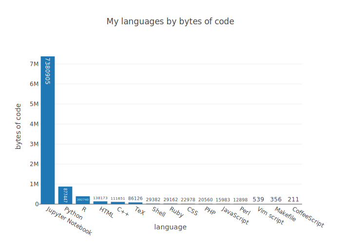
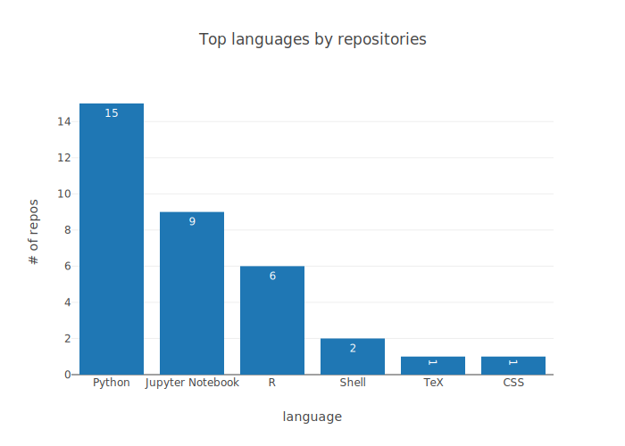

# lang-stats
Collect personal programming language statistics from GitHub repos using [PyGithub](https://pygithub.readthedocs.io/en/latest/).

## Usage

1. Clone this repo.

    ```
    git clone https://github.com/kelly-sovacool/lang-stats
    ```

1. Create a file `credentials.yaml` with your github login info:

    ```
    login: your_login
    password: your_password
    ```

    **Warning**: do not add the credentials file to git. Be careful not to accidentally share it with anyone.

1. Install dependencies:

    ```
    conda env create -n lang-stats -f environment.yaml
    conda activate lang-stats
    ```

1. Create plots of your programming languages from your github repos:

    ```
    ./langstats.py
    ```
    
    They will be located in `figures/`.
    
    
    
    